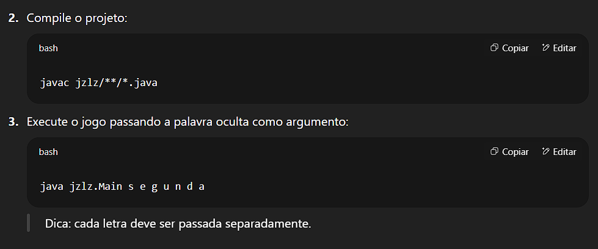

# 🎮 Jogo da Forca em Java (Console)

Este projeto é parte do desafio da DIO para praticar Programação Orientada a Objetos (POO) em Java. Trata-se de uma implementação completa do jogo da forca executado via console, com menus interativos e visualização textual da forca.

## 📌 Objetivos

- Aplicar os conceitos de **POO**: classes, objetos, encapsulamento e enums.
- Trabalhar com exceções personalizadas.
- Criar uma interface simples no terminal.
- Praticar manipulação de listas, strings e fluxo de entrada/saída.
- Separar responsabilidades dentro de um projeto Java estruturado.

## 🛠️ Como Executar

1. Clone este repositório:
   ```bash
   git clone https://github.com/seu-usuario/hangman-java.git
   cd hangman-java



🎮 Como Jogar
O jogo apresenta um menu com três opções:

1: Informar uma letra
2: Verificar o status atual do jogo
3: Sair

Ao errar uma letra, o boneco da forca será desenhado progressivamente.
O jogo termina quando o jogador acerta todas as letras ou atinge o limite de 6 erros.

💡 Funcionalidades e Conceitos Utilizados
Conceito	Implementação
POO	Classes HangmanChar, HangmanGame, uso de enum para status
Encapsulamento	Atributos privados com métodos de acesso
Exceções Personalizadas	GameIsFinishedException, LetterAlreadyInputtedException
Listas e Streams	Manipulação de letras e construção da forca
StringBuilder	Atualização visual da forca
Scanner	Entrada de dados do usuário via terminal
